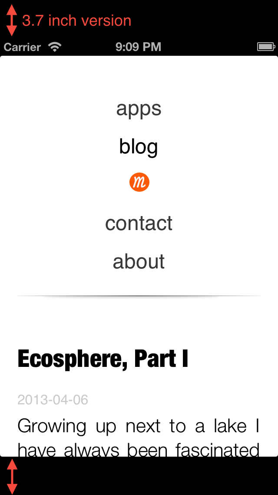

Tonight I was going to add some cool features to this website that would make browsing it more pleasant. I added some touch icons that would appear on ones iPhone homescreen and wanted to make it standalone when by using

	<meta name="apple-mobile-web-app-capable" content="yes" />

when I discovered that standalone apps appear in the 3.7 inch version only. I am not sure if this is a bug or a feature. Anyways I switched, because I didn't like how it looked:

You can read more about configuring your webapps for iPhone in the [Safari Web Content Guide](http://developer.apple.com/library/ios/#documentation/AppleApplications/Reference/SafariWebContent/ConfiguringWebApplications/ConfiguringWebApplications.html).
